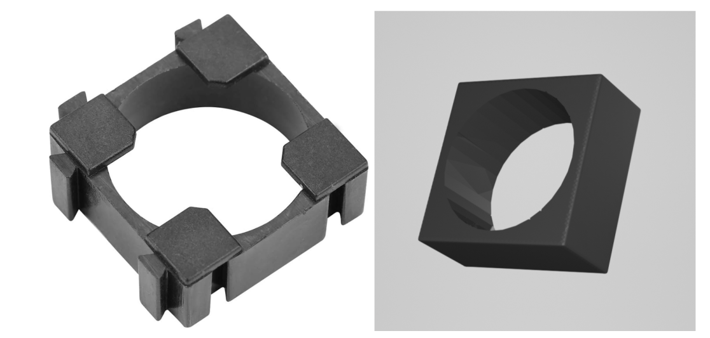
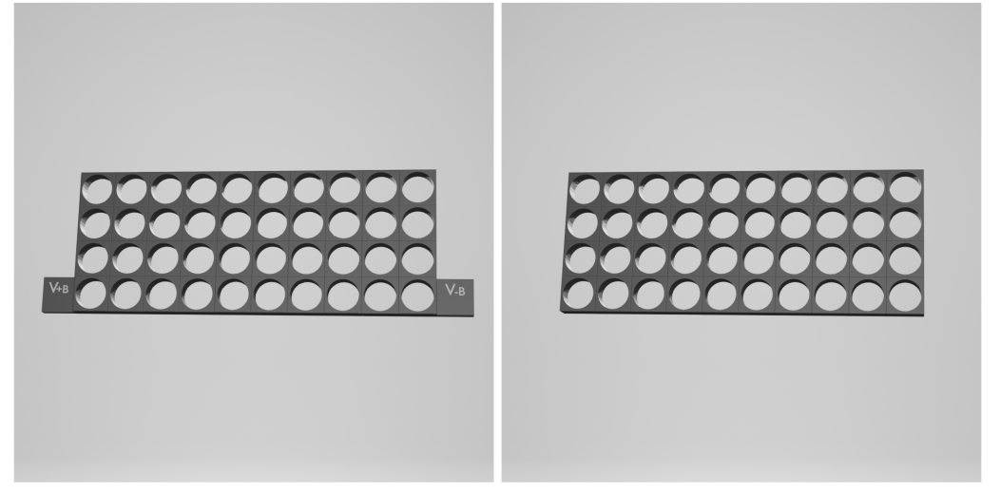
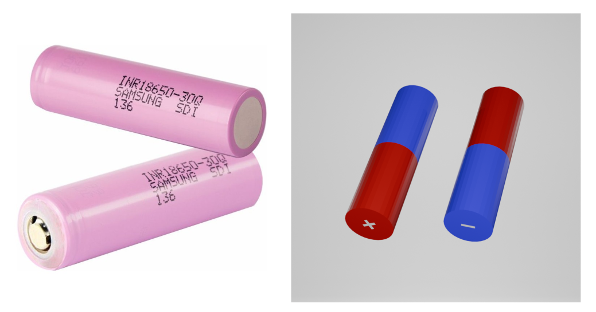
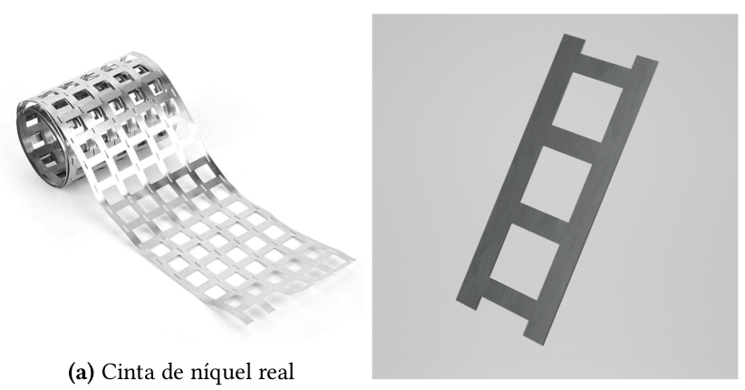
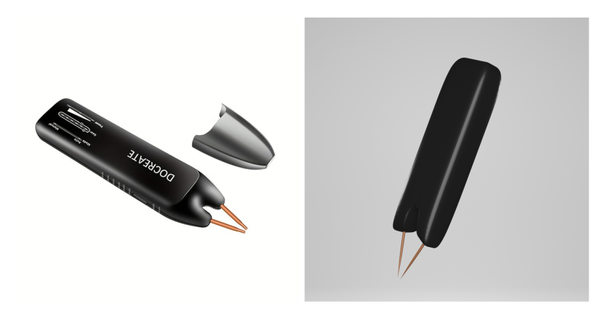
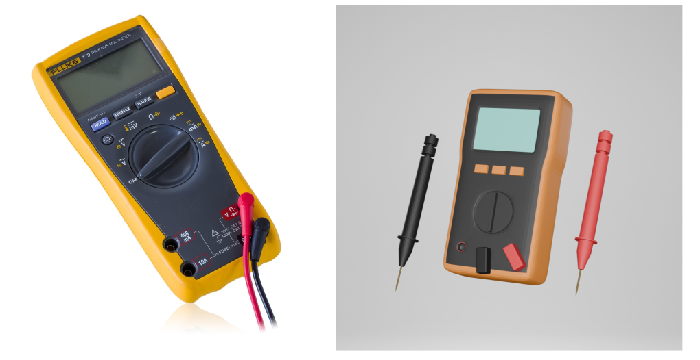
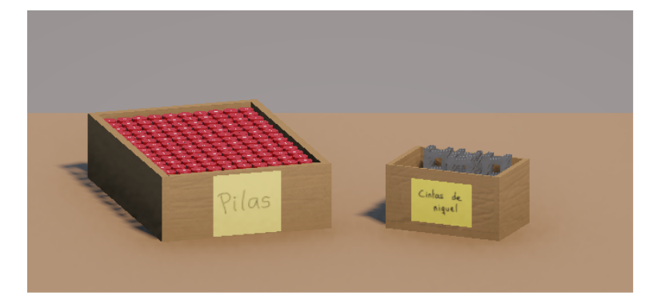
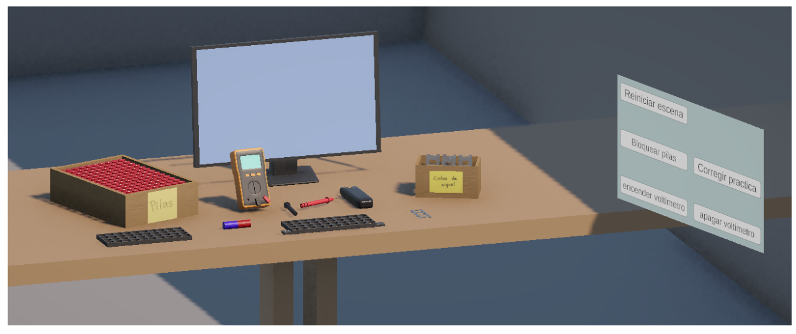

# Simulador educativo de soldadura de baterías de litio en realidad virtual 🔋🧰

**Autora:** Iraida Abad López  
**Fecha:** Octubre 2025  
**Tutorizado por:** Iñigo López Gazpio & Igor Rodríguez Rodríguez  

---

## 🧠 Descripción

Este proyecto corresponde al **Trabajo de Fin de Grado en Ingeniería Informática**, y tiene como objetivo **desarrollar una aplicación educativa en realidad virtual (RV)** que simule el proceso de **ensamblaje y soldadura de un paquete de baterías de litio tipo 10s4p**.  

La aplicación permite al alumnado **practicar de forma segura** el proceso de montaje, eliminando los riesgos físicos y optimizando el uso de materiales.  
El simulador recrea un **aula virtual inmersiva** donde el usuario puede interactuar con celdas de litio, cintas de níquel, soportes y herramientas reales modeladas en 3D.  

El proyecto busca **fomentar el aprendizaje práctico y seguro**, alineado con los **Objetivos de Desarrollo Sostenible (ODS)**, especialmente el de *educación de calidad e inclusiva*.

---

## 🧩 Tecnologías utilizadas

- **Unity (C#)** – Motor principal del entorno de realidad virtual  
- **Blender** – Modelado 3D de herramientas y componentes  
- **XR Interaction Toolkit** – Gestión de interacciones e inmersión en RV  
- **Oculus Meta Quest 2 / 3** – Dispositivos de prueba y ejecución  
- **Unity Hub & Unity Version Control** – Control y gestión del proyecto  
- **Google Drive & Plastic SCM** – Almacenamiento y control de versiones  

---

## 🎮 Características principales

- Simulación **interactiva y educativa** del proceso de soldadura por puntos.  
- Modelado digital de todos los elementos:
  - Celdas de litio 18650  
  - Cintas de níquel  
  - Soporte 10s4p  
  - Soldador de puntos y multímetro funcional  
- Sistema de **retroalimentación** para evaluar la práctica y corregir errores.  
- Escenario optimizado en rendimiento, con materiales y colores simples.  
- Interfaz de usuario (UI) que permite reiniciar, validar o bloquear elementos.  
- Compatibilidad con **Meta Quest 2 y 3** en modo inalámbrico o conectado.  

---

## 🧱 Objetivos del proyecto

- Desarrollar un **entorno formativo seguro y realista** para el alumnado.  
- Explorar el uso de **RV como herramienta educativa** en ingeniería.  
- Reducir riesgos asociados a la soldadura de baterías reales.  
- Fomentar la inclusión educativa y accesibilidad mediante RV.  
- Establecer una base para futuras versiones con funcionalidades ampliadas.  

---

## 📸 Capturas del juego

## 🎥 Demostración del simulador

